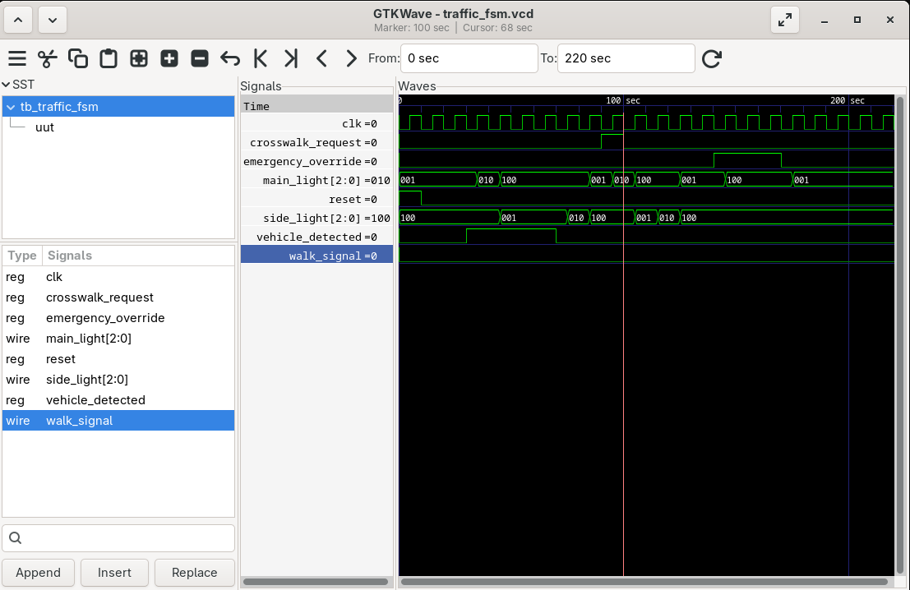
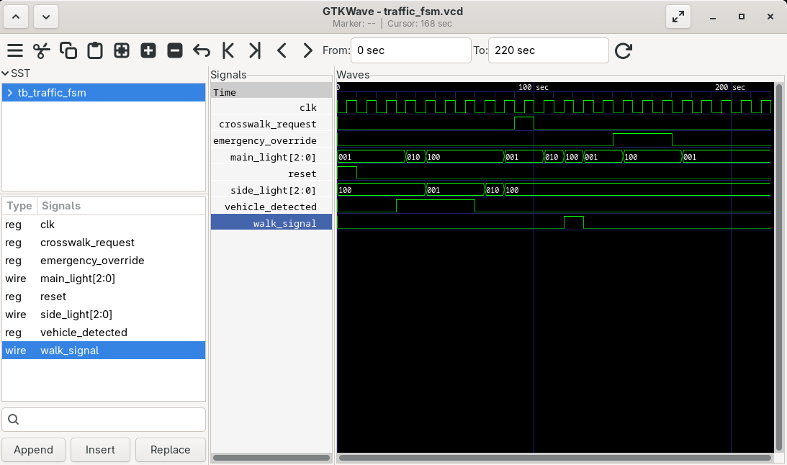

# Smart Traffic Light Controller (FSM)

## Architecture Overview
This module implements a Moore Finite State Machine (FSM) to control a smart traffic intersection. It was designed utilizing the industry-standard 3-always block methodology to cleanly separate the sequential state register, next-state combinational logic, and combinational output logic. 

**Core Features:**
* Base traffic cycling (Main Street vs. Side Street)
* Emergency vehicle override (Asynchronous priority forced-red state)
* Sequential hardware latch for asynchronous pedestrian inputs

## Hardware Revision & Timing Analysis
During initial verification, static timing analysis of the waveform revealed an input-drop bug. A 10ns pedestrian button press (`crosswalk_request`) was dropped because the pulse width was shorter than the FSM's transitional state time.

**Before Revision:** The FSM misses the fast asynchronous pulse and fails to trigger the `walk_signal`.

**The Solution:** Rather than widening the testbench pulse (hiding the bug), I architected a dedicated memory register (`crosswalk_latched`) within the sequential block. This instantly captures asynchronous edge-cases and holds the state true until the FSM safely cycles to the crosswalk state.

**After Revision:** The hardware successfully latches the short input pulse, routes the FSM through the safe yellow transition, and executes the walk signal perfectly.

